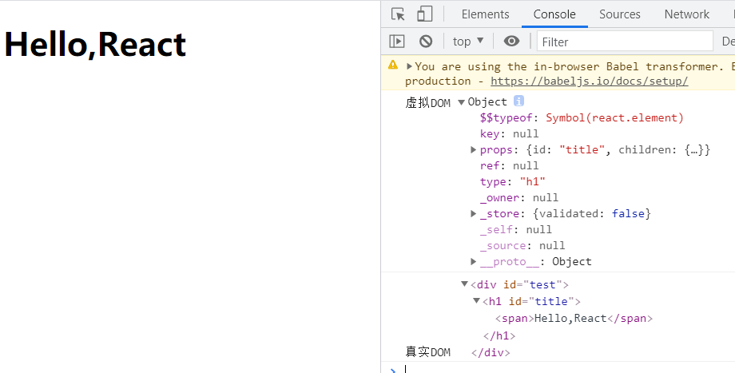

# React基础笔记

## 1. React入门

### 1.1 hello_react

因为是刚开始学习React，没有用到React脚手架，所以要使用3个相关的js库。

* react.js：React核心库

* react-dom.js：提供操作DOM的react扩展库

* babel.min.js：解析jsx语法转为JS代码的库。

```html
<body>
    <!-- 准备好一个容器 -->
    <div id="test"></div>
    <!-- 引入react核心库 -->
    <script src="../js/react.development.js"></script>
    <!-- 引入react-dom,用于支持react操作dom -->
    <script src="../js/react-dom.development.js"></script>
    <!-- 引入babel,用于将jsx转为js -->
    <script src="../js/babel.min.js"></script>

    <script type="text/babel"> /*此处一定要写babel*/
        // 1.创建虚拟dom
        const VDOM = <h1>Hello,React</h1>
        // 2.渲染虚拟dom到页面
        ReactDOM.render(VDOM,document.getElementById('test'))
    </script>
</body>
```

### 1.2 虚拟DOM的两种创建方式

#### 1.2.1 两种方式

1. 用jsx方式创建
  
   ```html
   <body>
       <!-- 准备好一个容器 -->
       <div id="test"></div>
       <!-- 引入react核心库 -->
       <script src="../js/react.development.js"></script>
       <!-- 引入react-dom,用于支持react操作dom -->
       <script src="../js/react-dom.development.js"></script>
       <!-- 引入babel,用于将jsx转为js -->
       <script src="../js/babel.min.js"></script>
   
       <script type="text/babel"> /*此处一定要写babel*/
       const VDOM = (
           <h1 id="title">
               <span>Hello,React</span>
           </h1>
       )
       ReactDOM.render(VDOM,document.getElementById('test'))
   ```

2. 用纯js方式创建（不推荐）
  
   ```html
   <body>
       <!-- 准备好一个容器 -->
       <div id="test"></div>
       <!-- 引入react核心库 -->
       <script src="../js/react.development.js"></script>
       <!-- 引入react-dom,用于支持react操作dom -->
       <script src="../js/react-dom.development.js"></script>
   ```

       <script type="text/javascript"> 
           // 1.创建虚拟dom
           const VDOM = React.createElement('h1',{'id':'title'},React.createElement('span',{},'hello,react')) /* 标签名称 标签属性 标签内容*/
           // 2.渲染虚拟dom到页面
           ReactDOM.render(VDOM,document.getElementById('test'))
       </script>

</body>
   ```

#### 1.2.2 虚拟DOM和真实DOM的比较

​```html
<body>
        <!-- 准备好一个容器 -->
        <div id="test"></div>
        <!-- 引入react核心库 -->
        <script src="../js/react.development.js"></script>
        <!-- 引入react-dom,用于支持react操作dom -->
        <script src="../js/react-dom.development.js"></script>
        <!-- 引入babel,用于将jsx转为js -->
        <script src="../js/babel.min.js"></script>

        <script type="text/babel">
            /*此处一定要写babel*/
            // 1.创建虚拟dom
            const VDOM = (
                <h1 id="title">
                    <span>Hello,React</span>
                </h1>
            );
            // 2.渲染虚拟dom到页面
            const TDOM = document.getElementById("test")
            ReactDOM.render(VDOM, document.getElementById("test"));
            console.log("虚拟DOM",VDOM)
            console.log("真实DOM",TDOM)
        </script>
    </body>
   ```


关于虚拟DOM:

**1.本质是Object类型的对象**

**2.虚拟DOM比较‘轻’，真实DOM"比较重"**

**3.虚拟DOM最终会被React转化为真实DOM，呈现在页面上**

### 1.3 jsx语法规则

jsx语法规则：

​            1.定义虚拟DOM时，不要写引号。

​            2.标签中混入JS表达式时要用{}。

​            3.样式的类名指定不要用class，要用className。

​            4.内联样式，要用style={{key:value}}的形式去写。

​            5.只有一个根标签

​            6.标签必须闭合

​            7.标签首字母

​                (1).若小写字母开头，则将该标签转为html中同名元素，若html中无该标签对应的同名元素，则报错。

​                (2).若大写字母开头，react就去渲染对应的组件，若组件没有定义，则报错。

```html
<body>
        <!-- 准备好一个容器 -->
        <div id="test"></div>
        <!-- 引入react核心库 -->
        <script src="../js/react.development.js"></script>
        <!-- 引入react-dom,用于支持react操作dom -->
        <script src="../js/react-dom.development.js"></script>
        <!-- 引入babel,用于将jsx转为js -->
        <script src="../js/babel.min.js"></script>

        <script type="text/babel">
            //1.创建虚拟DOM
        const VDOM = (
            <div>
                <h2 className="title" id={myId.toLowerCase()}>
                    <span style={{color:'white',fontSize:'29px'}}>{myData.toLowerCase()}</span>
                </h2>
                <h2 className="title" id={myId.toUpperCase()}>
                    <span style={{color:'white',fontSize:'29px'}}>{myData.toLowerCase()}</span>
                </h2>
                <input type="text"/>
            </div>
        )
        //2.渲染虚拟DOM到页面
        ReactDOM.render(VDOM,document.getElementById('test'))

        /* 
                jsx语法规则：
                        1.定义虚拟DOM时，不要写引号。
                        2.标签中混入JS表达式时要用{}。
                        3.样式的类名指定不要用class，要用className。
                        4.内联样式，要用style={{key:value}}的形式去写。
                        5.只有一个根标签
                        6.标签必须闭合
                        7.标签首字母
                                (1).若小写字母开头，则将该标签转为html中同名元素，若html中无该标签对应的同名元素，则报错。
                                (2).若大写字母开头，react就去渲染对应的组件，若组件没有定义，则报错。

         */
        </script>
    </body>
```

### 1.4 模块与组件、模块化与组件化的理解

#### 1.4.1 模块

1. 理解：向外提供特定功能的js程序, 一般就是一个js文件

2. 为什么要拆成模块：随着业务逻辑增加，代码越来越多且复杂。

3. 作用： 复用js, 简化js的编写, 提高js运行效率

#### 1.4.2 组件

1. 理解：用来实现局部功能效果的代码和资源的集合(html/css/js/image等等)

2. 为什么要用组件： 一个界面的功能更复杂

3. 作用：复用编码, 简化项目编码, 提高运行效率

#### 1.4.3 模块化

​    当应用的js都以模块来编写的，这个应用就是一个模块化的应用

#### 1.4.4 组件化

​    当应用是以多组件的方式实现, 这个应用就是一个组件化的应用

## 2. React面向组件编程

### 2.1 React中定义组件的两种方式

**1.函数式组件**

```html
<body>
 <!-- 准备好一个容器 -->
 <div id="test"></div>
 <!-- 引入react核心库 -->
 <script src="../js/react.development.js"></script>
 <!-- 引入react-dom,用于支持react操作dom -->
 <script src="../js/react-dom.development.js"></script>
 <!-- 引入babel,用于将jsx转为js -->
 <script src="../js/babel.min.js"></script>

 <script type="text/babel">
     // 1.创建函数式组件
     function Demo() {
         console.log(this) // 此处的this是undefined,因为babel编译后开启了严格模式。
         return <h2>我是用函数定义的组件（适用于【简单组件】的定义）</h2>
     }
     //2.渲染组件到页面
     ReactDOM.render(<Demo/>,document.getElementById('test'))
     /*
         上面的代码执行后，
         1.react解析组件标签，找到了Demo组件。
         2.发现组件是使用函数定义的，随后调用该函数，将返回的虚拟DOM转为真实DOM,随后呈现在页面中。
     */
 </script>

</body>
```

**2.类式组件**

```html
<body>
    <!-- 准备好一个容器 -->
    <div id="test"></div>
    <!-- 引入react核心库 -->
    <script src="../js/react.development.js"></script>
    <!-- 引入react-dom,用于支持react操作dom -->
    <script src="../js/react-dom.development.js"></script>
    <!-- 引入babel,用于将jsx转为js -->
    <script src="../js/babel.min.js"></script>

    <script type="text/babel">
        // 1.创建类式组件
        class MyComponent extends React.Component{
            // render是放在哪里的？-MyComponent的原型对象上，供实例使用。
            // render中的this是谁？-MyComponent的实例对象。
            render() {
                return <h2>我是用类定义的组件适用于【复杂组件】的定义</h2>
            }
        }
        //2.渲染组件到页面
        // 上面的render()和这里的render 没有任何
        ReactDOM.render(<MyComponent/>,document.getElementById('test'))
        /*
            上面的代码执行后，
            1.react解析组件标签，找到了Demo组件。
            2.发现组件是使用类定义的，随后new出该类的实例，并通过该实例调用到原型上的render方法。
            3.将render返回的虚拟DOM转为真实DOM,随后呈现在页面中。
        */
    </script>

</body>
```

### 2.2 组件实例三大属性__state

#### 2.2.1state完全写法

```html
<body>
    <!-- 准备好一个“容器” -->
    <div id="test"></div>

    <!-- 引入react核心库 -->
    <script type="text/javascript" src="../js/react.development.js"></script>
    <!-- 引入react-dom，用于支持react操作DOM -->
    <script type="text/javascript" src="../js/react-dom.development.js"></script>
    <!-- 引入babel，用于将jsx转为js -->
    <script type="text/javascript" src="../js/babel.min.js"></script>

    <script type="text/babel">
        //1.创建组件
        class Weather extends React.Component{

            //构造器调用几次？ ———— 1次
            constructor(props){
                console.log('constructor');
                super(props)
                //初始化状态
                this.state = {isHot:false,wind:'微风'}
                //解决changeWeather中this指向问题
                this.changeWeather = this.changeWeather.bind(this)
            }

            //render调用几次？ ———— 1+n次 1是初始化的那次 n是状态更新的次数
            render(){
                console.log('render');
                //读取状态
                const {isHot,wind} = this.state
                // 事件名称后面不要带括号，加了括号在页面渲染完后就会自动调用该方法。 React会在触发该事件之后自动调用该方法。
                return <h1 onClick={this.changeWeather}>今天天气很{isHot ? '炎热' : '凉爽'}，{wind}</h1>
            }

            //changeWeather调用几次？ ———— 点几次调几次
            changeWeather(){
                //changeWeather放在哪里？ ———— Weather的原型对象上，供实例使用
                //由于changeWeather是作为onClick的回调，所以不是通过实例调用的，是直接调用
                //类中的方法默认开启了局部的严格模式，所以changeWeather中的this为undefined

                console.log('changeWeather');
                //获取原来的isHot值
                const isHot = this.state.isHot
                //严重注意：状态必须通过setState进行更新,且更新是一种合并，不是替换。
                this.setState({isHot:!isHot})
                console.log(this);

                //严重注意：状态(state)不可直接更改，下面这行就是直接更改！！！
                //this.state.isHot = !isHot //这是错误的写法
            }
        }
        //2.渲染组件到页面
        ReactDOM.render(<Weather/>,document.getElementById('test'))

    </script>
</body>
```

#### 2.2.2 state简写

```html
<body>
        <!-- 准备好一个容器 -->
        <div id="test"></div>
        <!-- 引入react核心库 -->
        <script src="../js/react.development.js"></script>
        <!-- 引入react-dom,用于支持react操作dom -->
        <script src="../js/react-dom.development.js"></script>
        <!-- 引入babel,用于将jsx转为js -->
        <script src="../js/babel.min.js"></script>

        <script type="text/babel">
            // 1.创建组件
            class Weather extends React.Component {
                // constructor(props) {
                //     super(props);
                //     // 初始化状态
                //     this.state = { isHot: true, wind: '微风' };
                //     //  解决changeWeather中this指向问题
                //     this.changeWeather = this.changeWeather.bind(this)
                // }

                // 初始化状态
                state = { isHot: true, wind: "微风" };

                render() {
                    // return <h2 onClick={this.changeWeather}>今天天气很{this.state.isHot ? "炎热" : "凉爽"}</h2>;
                    return <h2 onClick={()=> this.changeWeather()}>今天天气很{this.state.isHot ? "炎热" : "凉爽"}</h2>;
                }

                // 自定义方法--要用赋值语句和箭头函数的形式
                changeWeather = () => {
                    // 状态state 不可直接更改！
                    // this.state.isHot = !this.state.isHot
                    const isHot = this.state.isHot;
                    // 状态必须通过setState进行更新，且更新是一种合并，不是替换。
                    this.setState({ isHot: !isHot });
                };

                // 自定义方法形式之一，在调用时用箭头函数调用
                changeWeather() {
                    const isHot = this.state.isHot;
                    this.setState({ isHot: !isHot });
                }
            }

            // 2.渲染组件
            ReactDOM.render(<Weather />, document.getElementById("test"));
        </script>
    </body>
```

#### 2.2.3 state总结

1. state是组件对象最重要的属性, **值是对象**(可以包含多个key-value的组合)

2. 组件被称为"状态机", 通过更新组件的state来更新对应的页面显示(重新渲染组件)

**<font color="red">注意：</font >**

1. 组件中render方法中的this为组件实例对象

2. 组件自定义的方法中this为undefined，如何解决？
  
   a)   强制绑定this: 通过函数对象的bind()
   
   b)   箭头函数+赋值语句
   
   c)  普通方法 + 在调用的时候写箭头函数调用。
   
   以上是React中自定义函数的三种方法。

3. 状态数据，不能直接修改或更新。必须通过setState()方法。

### 2.3 组件实例三大属性__props

**简介**：

1. 每个组件对象都会有props(properties的简写)属性
2. 组件标签的所有属性都保存在props中

**作用：**

1. 通过标签属性**从组件外向组件内传递变化的数据**

2. 注意: 组件内部不要修改props数据

#### 2.3.1 props的基本使用

```html
<!DOCTYPE html>
<html lang="en">
    <head>
        <meta charset="UTF-8" />
        <meta http-equiv="X-UA-Compatible" content="IE=edge" />
        <meta name="viewport" content="width=device-width, initial-scale=1.0" />
        <title>Document</title>
    </head>
    <body>
        <!-- 准备好一个容器 -->
        <div id="test"></div>
        <div id="test1"></div>
        <div id="test2"></div>
        <!-- 引入react核心库 -->
        <script src="../js/react.development.js"></script>
        <!-- 引入react-dom,用于支持react操作dom -->
        <script src="../js/react-dom.development.js"></script>
        <!-- 引入babel,用于将jsx转为js -->
        <script src="../js/babel.min.js"></script>

        <script type="text/babel">
            // 创建组件
            class Person extends React.Component {
                render() {
                    return (
                        <ul>
                            <li>姓名：{this.props.name}</li>
                            <li>性别：{this.props.sex}</li>
                            <li>年龄：{this.props.age+1}</li>
                        </ul>
                    );
                }
            }
            // 渲染组件到页面
            ReactDOM.render(<Person name='jerry' age='19' sex='女'/>,document.getElementById('test'))
            ReactDOM.render(<Person name='tom' age='18' sex='男'/>,document.getElementById('test1'))
            const p = {name:'老刘',age:18,sex:'女'}
            // 批量传递props也叫批量传递标签属性
            ReactDOM.render(<Person {...p}/>,document.getElementById("test2"))
            // ReactDOM.render(<Person name='老刘' age='29' sex='女'/>,document.getElementById('test2'))
        </script>
    </body>
</html>
```

#### 2.3.2 对props进行限制

```html
<!DOCTYPE html>
<html lang="en">
    <head>
        <meta charset="UTF-8" />
        <meta http-equiv="X-UA-Compatible" content="IE=edge" />
        <meta name="viewport" content="width=device-width, initial-scale=1.0" />
        <title>Document</title>
    </head>
    <body>
        <!-- 准备好一个容器 -->
        <div id="test"></div>
        <div id="test1"></div>
        <div id="test2"></div>
        <!-- 引入react核心库 -->
        <script src="../js/react.development.js"></script>
        <!-- 引入react-dom,用于支持react操作dom -->
        <script src="../js/react-dom.development.js"></script>
        <!-- 引入babel,用于将jsx转为js -->
        <script src="../js/babel.min.js"></script>
        <!-- 引入prop-types,用于对组件标签进行限制 -->
        <script src="../js/prop-types.js"></script>

        <script type="text/babel">
            // 创建组件
            class Person extends React.Component {
                render() {
                    return (
                        <ul>
                            <li>姓名：{this.props.name}</li>
                            <li>性别：{this.props.sex}</li>
                            <li>年龄：{this.props.age}</li>
                        </ul>
                    );
                }
            }
            // 对标签属性进行类型、必要性的限制
            Person.propTypes = {
                name:PropTypes.string.isRequired,
                sex:PropTypes.string,
                age:PropTypes.number,
                speak:PropTypes.func,
            }
            // 指定默认标签属性值
            Person.defaultProps = {
                sex:'不男不女',
                age:18
            }

            // 渲染组件到页面
            ReactDOM.render(<Person name='jerry' age={19} speak={speak}/>,document.getElementById('test'))
            ReactDOM.render(<Person name='tom'  sex='男'/>,document.getElementById('test1'))
            const p = {name:'老刘',age:18,sex:'女',speak:speak}
            ReactDOM.render(<Person {...p}/>,document.getElementById("test2"))
            // ReactDOM.render(<Person name='老刘' age='29' sex='女'/>,document.getElementById('test2'))
            function speak() {
                console.log("说话。。")
            }
        </script>
    </body>
</html>
```

#### 2.3.3 props限制的简写方式

```html
<!DOCTYPE html>
<html lang="en">
    <head>
        <meta charset="UTF-8" />
        <meta http-equiv="X-UA-Compatible" content="IE=edge" />
        <meta name="viewport" content="width=device-width, initial-scale=1.0" />
        <title>Document</title>
    </head>
    <body>
        <!-- 准备好一个容器 -->
        <div id="test"></div>
        <div id="test1"></div>
        <div id="test2"></div>
        <!-- 引入react核心库 -->
        <script src="../js/react.development.js"></script>
        <!-- 引入react-dom,用于支持react操作dom -->
        <script src="../js/react-dom.development.js"></script>
        <!-- 引入babel,用于将jsx转为js -->
        <script src="../js/babel.min.js"></script>
        <!-- 引入prop-types,用于对组件标签进行限制 -->
        <script src="../js/prop-types.js"></script>

        <script type="text/babel">
            // 创建组件
            class Person extends React.Component {
                // 对标签属性进行类型、必要性的限制
                static propTypes = {
                    name: PropTypes.string.isRequired,
                    sex: PropTypes.string,
                    age: PropTypes.number,
                    speak: PropTypes.func,
                };
                // 指定默认标签属性值
                static defaultProps = {
                    sex: "不男不女",
                    age: 18,
                };

                state = {}

                render() {
                    const {name,age,sex} = this.props
                    return (
                        <ul>
                            <li>姓名：{name}</li>
                            <li>性别：{sex}</li>
                            <li>年龄：{age}</li>
                        </ul>
                    );
                }
            }

            // 渲染组件到页面
            ReactDOM.render(<Person name="jerry" age={19} speak={speak} />, document.getElementById("test"));
            ReactDOM.render(<Person name="tom" sex="男" />, document.getElementById("test1"));
            const p = { name: "老刘", age: 18, sex: "女", speak: speak };
            ReactDOM.render(<Person {...p} />, document.getElementById("test2"));
            // ReactDOM.render(<Person name='老刘' age='29' sex='女'/>,document.getElementById('test2'))
            function speak() {
                console.log("说话。。");
            }
        </script>
    </body>
</html>
```

#### 2.3.4 函数组件使用props

```html
<!DOCTYPE html>
<html lang="en">
    <head>
        <meta charset="UTF-8" />
        <meta http-equiv="X-UA-Compatible" content="IE=edge" />
        <meta name="viewport" content="width=device-width, initial-scale=1.0" />
        <title>Document</title>
    </head>
    <body>
        <!-- 准备好一个容器 -->
        <div id="test"></div>
        <div id="test1"></div>
        <div id="test2"></div>
        <!-- 引入react核心库 -->
        <script src="../js/react.development.js"></script>
        <!-- 引入react-dom,用于支持react操作dom -->
        <script src="../js/react-dom.development.js"></script>
        <!-- 引入babel,用于将jsx转为js -->
        <script src="../js/babel.min.js"></script>
        <!-- 引入prop-types,用于对组件标签进行限制 -->
        <script src="../js/prop-types.js"></script>

        <script type="text/babel">
            function Person(props) {
                const { name, age, sex } = props;
                return (
                    <ul>
                        <li>姓名：{name}</li>
                        <li>性别：{sex}</li>
                        <li>年龄：{age}</li>
                    </ul>
                );
            }

            // 对标签属性进行类型、必要性的限制
            Person.propTypes = {
                name: PropTypes.string.isRequired,
                sex: PropTypes.string,
                age: PropTypes.number,
                speak: PropTypes.func,
            };
            // 指定默认标签属性值
            Person.defaultProps = {
                sex: "不男不女",
                age: 18,
            };

            // 渲染组件到页面
            ReactDOM.render(<Person name="jerry" age={19} speak={speak} />, document.getElementById("test"));
            ReactDOM.render(<Person name="tom" sex="男" />, document.getElementById("test1"));
            const p = { name: "老刘", age: 18, sex: "女", speak: speak };
            ReactDOM.render(<Person {...p} />, document.getElementById("test2"));
            // ReactDOM.render(<Person name='老刘' age='29' sex='女'/>,document.getElementById('test2'))
            function speak() {
                console.log("说话。。");
            }
        </script>
    </body>
</html>
```

#### 2.3.5 props的总结

1. **内部读取某个属性值**

```javascript
this.props.name
```

2. **对props中的属性值进行类型限制和必要性限制**

第一种方式（React v15.5 开始已弃用）：

```javascript
Person.propTypes = {      
    name: React.PropTypes.string.isRequired,      
    age: React.PropTypes.number     
}      
```

第二种方式（新）：使用prop-types库进限制（需要引入prop-types库）

```javascript
Person.propTypes = {     
    name: PropTypes.string.isRequired,      
    age: PropTypes.number   
}   
```

3. **扩展属性: 将对象的所有属性通过props传递**
  
   ```javascript
   <Person {...person}/>
   ```

4. **默认属性值：**
  
   ```javascript
   Person.defaultProps = {
       sex: "不男不女",
       age: 18,
   };
   ```

5. **组件类的构造函数**
  
       ```javascript
       constructor(props){
           super(props);
           console.log(props)
       }
       ```

### 2.4 组件实例三大属性__refs

理解：组件内的标签可以定义ref属性来标识自己

#### 2.4.1 字符串形式的refs

**注意：**React官方说这种形式的refs会存在效率问题，不推荐使用。将会在未来的版本中移除。

```html
<!DOCTYPE html>
<html lang="en">
    <head>
        <meta charset="UTF-8" />
        <meta http-equiv="X-UA-Compatible" content="IE=edge" />
        <meta name="viewport" content="width=device-width, initial-scale=1.0" />
        <title>Document</title>
    </head>
    <body>
        <!-- 准备好一个容器 -->
        <div id="test"></div>

        <!-- 引入react核心库 -->
        <script src="../js/react.development.js"></script>
        <!-- 引入react-dom,用于支持react操作dom -->
        <script src="../js/react-dom.development.js"></script>
        <!-- 引入babel,用于将jsx转为js -->
        <script src="../js/babel.min.js"></script>

        <script type="text/babel">
            // 创建组件
            class Demo extends React.Component {
                // 展示左侧数据
                showData = () => {
                    const {input1} = this.refs
                    alert(input1.value)
                };
                // 展示右侧输入框的数据
                showData2 = ()=>{
                    const {input2} = this.refs
                    alert(input2.value)
                }

                render() {
                    return (
                        <div>
                            <input ref="input1" type="text" placeholder="点击按钮提示数据" />
                            <button onClick={this.showData}>点我提示左侧的数据</button>  
                            <input ref="input2" onBlur={this.showData2} type="text" placeholder="失去焦点提示数据" />
                        </div>
                    );
                }
            }


            // 渲染组件到页面
            ReactDOM.render(<Demo />, document.getElementById("test"));
        </script>
    </body>
</html>
```

#### 2.4.2 回调函数形式的refs

回调函数：1.自己定义的函数 2. 自己没有调用 3. 最终这个函数执行了。

```html
<!DOCTYPE html>
<html lang="en">
    <head>
        <meta charset="UTF-8" />
        <meta http-equiv="X-UA-Compatible" content="IE=edge" />
        <meta name="viewport" content="width=device-width, initial-scale=1.0" />
        <title>Document</title>
    </head>
    <body>
        <!-- 准备好一个容器 -->
        <div id="test"></div>

        <!-- 引入react核心库 -->
        <script src="../js/react.development.js"></script>
        <!-- 引入react-dom,用于支持react操作dom -->
        <script src="../js/react-dom.development.js"></script>
        <!-- 引入babel,用于将jsx转为js -->
        <script src="../js/babel.min.js"></script>

        <script type="text/babel">
            // 创建组件
            class Demo extends React.Component {
                // 展示左侧数据
                showData = () => {
                    // const {input1} = this.refs
                    // alert(input1.value)
                    console.log(this);
                    // 这里取input1节点就不从refs上取了，直接从this上取。
                    const {input1} = this
                    alert(input1.value)
                };
                // 展示右侧输入框的数据
                showData2 = ()=>{
                    // const {input2} = this.refs
                    // alert(input2.value)
                    const {input2} = this
                    alert(input2.value)
                }

                render() {
                    // ref = {(currentNode)=>{ this.input1 = currentNode }}
                    // ref中写箭头函数 react会自动帮你调用。
                    return (
                        <div>
                            <input ref={currentNode => this.input1 = currentNode} type="text" placeholder="点击按钮提示数据" />
                            <button onClick={this.showData}>点我提示左侧的数据</button>  
                            <input ref={currentNode => this.input2 = currentNode} onBlur={this.showData2} type="text" placeholder="失去焦点提示数据" />
                        </div>
                    );
                }
            }


            // 渲染组件到页面
            ReactDOM.render(<Demo />, document.getElementById("test"));
        </script>
    </body>
</html>
```

#### 2.4.3 回调ref中回调函数执行次数的问题

React 官方说法，地址：https://react.docschina.org/docs/refs-and-the-dom.html

> ### 关于回调 refs 的说明
> 
> 如果 `ref` 回调函数是以内联函数的方式定义的，在更新过程中它会被执行两次，第一次传入参数 `null`，然后第二次会传入参数 DOM 元素。这是因为在每次渲染时会创建一个新的函数实例，所以 React 清空旧的 ref 并且设置新的。通过将 ref 的回调函数定义成 class 的绑定函数的方式可以避免上述问题，但是大多数情况下它是无关紧要的。

```html
<!DOCTYPE html>
<html lang="en">
    <head>
        <meta charset="UTF-8" />
        <meta http-equiv="X-UA-Compatible" content="IE=edge" />
        <meta name="viewport" content="width=device-width, initial-scale=1.0" />
        <title>Document</title>
    </head>
    <body>
        <!-- 准备好一个容器 -->
        <div id="test"></div>

        <!-- 引入react核心库 -->
        <script src="../js/react.development.js"></script>
        <!-- 引入react-dom,用于支持react操作dom -->
        <script src="../js/react-dom.development.js"></script>
        <!-- 引入babel,用于将jsx转为js -->
        <script src="../js/babel.min.js"></script>

        <script type="text/babel">
            // 创建组件
            class Demo extends React.Component {
                state = { isHot: true };

                // 展示左侧数据
                showData = () => {
                    // const {input1} = this.refs
                    // alert(input1.value)
                    const { input1 } = this;
                    alert(input1.value);
                };
                // 展示右侧输入框的数据
                showData2 = () => {
                    // const {input2} = this.refs
                    // alert(input2.value)
                    const { input2 } = this;
                    alert(input2.value);
                };

                changeWeather = () => {
                    const { isHot } = this.state;
                    this.setState({ isHot: !isHot });
                };

                // 类的绑定函数形式
                saveInput = (c) => {
                    this.input1 = c;
                    console.log("@", c);
                };

                render() {
                    const { isHot } = this.state;
                    return (
                        <div>
                            <h2>今天天气很{isHot ? "炎热" : "凉爽"}</h2>
                        {/* 内联函数<input ref={(c) => {this.input1 = c;console.log('@',c);}}/>*/}
                            <input ref={this.saveInput} />
                            <button onClick={this.changeWeather}>切换状态</button>  
                            {/* <input ref={c => this.input2 = c} onBlur={this.showData2} type="text" placeholder="失去焦点提示数据" /> */}
                        </div>
                    );
                }
            }

            // 渲染组件到页面
            ReactDOM.render(<Demo />, document.getElementById("test"));
        </script>
    </body>
</html>
```

#### 2.4.4 createRef的使用

这种写法是官方推荐的

```html
<!DOCTYPE html>
<html lang="en">
    <head>
        <meta charset="UTF-8" />
        <meta http-equiv="X-UA-Compatible" content="IE=edge" />
        <meta name="viewport" content="width=device-width, initial-scale=1.0" />
        <title>Document</title>
    </head>
    <body>
        <!-- 准备好一个容器 -->
        <div id="test"></div>

        <!-- 引入react核心库 -->
        <script src="../js/react.development.js"></script>
        <!-- 引入react-dom,用于支持react操作dom -->
        <script src="../js/react-dom.development.js"></script>
        <!-- 引入babel,用于将jsx转为js -->
        <script src="../js/babel.min.js"></script>

        <script type="text/babel">
            // 创建组件
            class Demo extends React.Component {
                // React.creatRef调用后可以返回一个容器。该容器可以存储被ref锁标识的节点。该容器是专人专用的。
                myRef = React.createRef();
                myRef2 = React.createRef();
                // 展示左侧数据
                showData = () => {
                    alert(this.myRef.current.value)
                };
                // 展示右侧输入框的数据
                showData2 = ()=>{
                    alert(this.myRef2.current.value)
                }

                render() {
                    return (
                        <div>
                            <input ref={this.myRef} type="text" placeholder="点击按钮提示数据" />
                            <button onClick={this.showData}>点我提示左侧的数据</button>  
                            <input ref={this.myRef2} onBlur={this.showData2} type="text" placeholder="失去焦点提示数据" />
                        </div>
                    );
                }
            }


            // 渲染组件到页面
            ReactDOM.render(<Demo />, document.getElementById("test"));
        </script>
    </body>
</html>
```

#### 2.4.5 refs的总结

1. 字符串形式的ref
  
   ```html
   <input ref="input1"/>
   ```

2. 回调形式的ref
  
   ```html
   <input ref={(c)=>{this.input1 = c}}/>
   ```

3. createRef创建ref容器

    ```html
    myRef = React.createRef()
    <input ref={this.myRef}/>
    ```

### 2.5 React中的事件处理

1. 通过onXxx属性指定事件处理函数（注意大小写）

2. 通过 event.targe得到发生事件的DOM元素对象

```html
<!DOCTYPE html>
<html lang="en">
    <head>
        <meta charset="UTF-8" />
        <meta http-equiv="X-UA-Compatible" content="IE=edge" />
        <meta name="viewport" content="width=device-width, initial-scale=1.0" />
        <title>Document</title>
    </head>
    <body>
        <!-- 准备好一个容器 -->
        <div id="test"></div>

        <!-- 引入react核心库 -->
        <script src="../js/react.development.js"></script>
        <!-- 引入react-dom,用于支持react操作dom -->
        <script src="../js/react-dom.development.js"></script>
        <!-- 引入babel,用于将jsx转为js -->
        <script src="../js/babel.min.js"></script>

        <script type="text/babel">
            /*
                1.通过onXxx属性指定事件处理函数（注意大小写）
                2.通过 event.targe得到发生事件的DOM元素对象
             */

            // 创建组件
            class Demo extends React.Component {
                // React.creatRef调用后可以返回一个容器。该容器可以存储被ref锁标识的节点。该容器是专人专用的。
                myRef = React.createRef();
                myRef2 = React.createRef();
                // 展示左侧数据
                showData = () => {
                    alert(this.myRef.current.value)
                };
                // 展示右侧输入框的数据
                showData2 = ()=>{
                    alert(this.myRef2.current.value)
                }

                render() {
                    return (
                        <div>
                            <input ref={this.myRef} type="text" placeholder="点击按钮提示数据" />
                            <button onClick={this.showData}>点我提示左侧的数据</button>  
                            <input ref={this.myRef2} onBlur={this.showData2} type="text" placeholder="失去焦点提示数据" />
                        </div>
                    );
                }
            }

            // 渲染组件到页面
            ReactDOM.render(<Demo />, document.getElementById("test"));
        </script>
    </body>
</html>
```

### 2.6  收集表单数据

实际开发中，受控组件用的比较多。

#### 2.6.1 非受控组件

非受控组件：所有输入类型的dom（输入框，checkBox等等），如果数据是先用先去，就是非受控组件。

```html
<!DOCTYPE html>
<html lang="en">
    <head>
        <meta charset="UTF-8" />
        <meta http-equiv="X-UA-Compatible" content="IE=edge" />
        <meta name="viewport" content="width=device-width, initial-scale=1.0" />
        <title>Document</title>
    </head>
    <body>
        <!-- 准备好一个容器 -->
        <div id="test"></div>

        <!-- 引入react核心库 -->
        <script src="../js/react.development.js"></script>
        <!-- 引入react-dom,用于支持react操作dom -->
        <script src="../js/react-dom.development.js"></script>
        <!-- 引入babel,用于将jsx转为js -->
        <script src="../js/babel.min.js"></script>

        <script type="text/babel">
            class Login extends React.Component {

                render() {
                    return (
                        <form action="https://www.baidu.com" onSubmit={this.handleSubmit}>
                            用户名：
                            <input
                                ref={(c) => {
                                    this.username = c;
                                }}
                                type="text"
                            />
                            密码：
                            <input
                                ref={(c) => {
                                    this.password = c;
                                }}
                                type="password"
                            />
                            <button type="submit">登录</button>
                        </form>
                    );
                }

                handleSubmit = (event) => {
                    event.preventDefault();
                    const {username,password} = this;
                    alert(`用户名为：${username.value},密码为：${password.value}`);
                };
            }

            ReactDOM.render(<Login />, document.getElementById("test"));
        </script>
    </body>
</html>
```

#### 2.6.2 受控组件

受控组件：对于页面上的所有输入类型的dom，随着页面上输入的内容的变化，会将数据维护到React中的state中，需要用数据直接从state中取。这种组件就叫做受控组件（类似于Vue中的双向数据绑定。）

```html
<!DOCTYPE html>
<html lang="en">
    <head>
        <meta charset="UTF-8" />
        <meta http-equiv="X-UA-Compatible" content="IE=edge" />
        <meta name="viewport" content="width=device-width, initial-scale=1.0" />
        <title>Document</title>
    </head>
    <body>
        <!-- 准备好一个容器 -->
        <div id="test"></div>

        <!-- 引入react核心库 -->
        <script src="../js/react.development.js"></script>
        <!-- 引入react-dom,用于支持react操作dom -->
        <script src="../js/react-dom.development.js"></script>
        <!-- 引入babel,用于将jsx转为js -->
        <script src="../js/babel.min.js"></script>

        <script type="text/babel">
            class Login extends React.Component {
                state = {
                    username:'',
                    password:''
                }


                render() {
                    return (
                        <form action="https://www.baidu.com" onSubmit={this.handleSubmit}>
                            用户名：
                            <input onChange={this.getUserName} type="text" />
                            密码：
                            <input onChange={this.getPassWord} type="password" />
                            <button type="submit">登录</button>
                        </form>
                    );
                }

                handleSubmit = (event) => {
                    event.preventDefault();
                    const { username, password } = this.state;
                    alert(`用户名为：${username},密码为：${password}`);
                };

                getUserName = (event) => {
                    // console.log(event.target.value);
                    this.setState({username:event.target.value})
                }

                getPassWord = (event) => {
                    this.setState({password:event.target.value})
                }

            }

            ReactDOM.render(<Login />, document.getElementById("test"));
        </script>
    </body>
</html>
```

### 2.7 高阶函数——函数柯力化

**高阶函数：如果一个函数符合以下任意一点都属于高阶函数**

1. A函数，**接受的参数是一个函数。**

2. A函数，**返回值是一个函数。**

常见的高阶函数：**Promise setTimeout arr.map()**

函数的柯力化：**通过函数调用继续返回函数的方式，实现多次接受参数最后统一处理的函数编码形式。**

```html
<!DOCTYPE html>
<html lang="en">
    <head>
        <meta charset="UTF-8" />
        <meta http-equiv="X-UA-Compatible" content="IE=edge" />
        <meta name="viewport" content="width=device-width, initial-scale=1.0" />
        <title>Document</title>
    </head>
    <body>
        <!-- 准备好一个容器 -->
        <div id="test"></div>

        <!-- 引入react核心库 -->
        <script src="../js/react.development.js"></script>
        <!-- 引入react-dom,用于支持react操作dom -->
        <script src="../js/react-dom.development.js"></script>
        <!-- 引入babel,用于将jsx转为js -->
        <script src="../js/babel.min.js"></script>

        <script type="text/babel">
            // 创建组件
            class Login extends React.Component {
                // 初始化状态
                state = {
                    username: "",
                    password: "",
                };

                submit = (event) => {
                    event.preventDefault(); // 阻止表单提交

                    const { username, password } = this.state;
                    alert("你输入的用户名是：" + username + "," + "你输入的密码是：" + password);
                };

                saveFormData = (dataType) => {
                    // console.log('A',dataType);
                    return (event) => {
                        this.setState({ [dataType]: event.target.value });
                    };
                };

                // onXXX={}   花括号里面必须是返回一个函数 而不是直接调用一个函数
                render() {
                    return (
                        <form onSubmit={this.submit}>
                            用户名：
                            <input onChange={this.saveFormData("username")} type="text" name="username" />
                            密码：
                            <input onChange={this.saveFormData("password")} type="password" name="password" />
                            <button>登录</button>
                        </form>
                    );
                }
            }

            // 渲染组件
            ReactDOM.render(<Login />, document.getElementById("test"));
        </script>
    </body>
</html>
```

### 2.8 组件的生命周期

理解：

1. 组件从创建到死亡它会经历一些特定的阶段。

2. React组件中包含一系列勾子函数(生命周期回调函数), 会在特定的时刻调用。

3. 我们在定义组件时，会在特定的生命周期回调函数中，做特定的工作。

#### 2.8.1 生命周期（旧）

.png)

生命周期的三个阶段（旧）

1. **初始化阶段**: 由ReactDOM.render()触发---初次渲染
  
   1. constructor()
   
   2. componentWillMount()
   
   3. render()
   
   4. **componentDidMount()** =====> 常用
     
      一般在这个钩子中做一些初始化的事，例如：开启定时器、发送网络请求、订阅消息

2. **更新阶段**: 由组件内部this.setSate()或父组件render触发
  
   1. shouldComponentUpdate()
   
   2. componentWillUpdate()
   
   3. **render()** =====> 必须使用的一个
   
   4. componentDidUpdate()

3. **卸载组件**: 由ReactDOM.unmountComponentAtNode()触发
  
   1. **componentWillUnmount()** =====> 常用
   
   ​    一般在这个钩子中做一些收尾的事，例如：关闭定时器、取消订阅消息

```html
<!DOCTYPE html>
<html lang="en">
    <head>
        <meta charset="UTF-8" />
        <meta http-equiv="X-UA-Compatible" content="IE=edge" />
        <meta name="viewport" content="width=device-width, initial-scale=1.0" />
        <title>Document</title>
    </head>
    <body>
        <!-- 准备好一个容器 -->
        <div id="test"></div>

        <!-- 引入react核心库 -->
        <script src="../js/react.development.js"></script>
        <!-- 引入react-dom,用于支持react操作dom -->
        <script src="../js/react-dom.development.js"></script>
        <!-- 引入babel,用于将jsx转为js -->
        <script src="../js/babel.min.js"></script>

        <script type="text/babel">
            //   创建组件
            class Count extends React.Component {
                // 构造器
                constructor(props) {
                    console.log("Count-constructor");
                    super(props);
                    // 初始化状态
                    this.state = { num: 0 };
                }

                // 组件将要挂载的钩子
                componentWillMount() {
                    console.log("Count--componentWillMount");
                }

                // 组件挂载完毕的的钩子
                componentDidMount() {
                    console.log("Count--componentDidMount");
                }

                // 组件将要卸载的钩子
                componentWillUnmount() {
                    console.log("Count--componentWillUnmount");
                }

                // 控制组件更新的阀门
                shouldComponentUpdate() {
                    console.log("Count--shouldComponentUpdate");
                    return false;
                }

                // 组件将要更新的钩子
                componentWillUpdate() {
                    console.log("Count--componentWillupdate");
                }

                componentDidUpdate() {
                    console.log("Count--componentDidUpdate");
                }

                sum = () => {
                    // let {num} = this.state 两种写法
                    // num += 1
                    // this.setState({num})

                    const { num } = this.state;
                    this.setState({ num: num + 1 });
                };

                death = () => {
                    ReactDOM.unmountComponentAtNode(document.getElementById("test"));
                };

                // 强制更新按钮的回调
                force = () => {
                    this.forceUpdate();
                };

                render() {
                    console.log("Count--render");
                    return (
                        <div>
                            <h2>{this.state.num}</h2>
                            <button onClick={this.sum}>点我加一</button>
                            <button onClick={this.death}>卸载组件</button>
                            <button onClick={this.force}>强制更新</button>
                        </div>
                    );
                }
            }

            class A extends React.Component {
                // 初始化状态
                state = {carName:'奥拓'}

                changeCar = ()=>{
                    this.setState({carName:'奥迪'})
                }

                render() {
                    return (
                        <div>
                            <h2>我是A组件</h2>
                            <button onClick={this.changeCar}>换车</button>
                            <B carName={this.state.carName}/>
                        </div>
                    );
                }
            }

            class B extends React.Component {
                componentWillReceiveProps() {
                    console.log('B---componentWillReceiveProps');
                }

                render() {
                    return <div>
                        <h2>我是B组件，接收到的车名是：{this.props.carName}</h2>
                        </div>;
                }
            }
            // 渲染组件到页面
            ReactDOM.render(<A />, document.getElementById("test"));
        </script>
    </body>
</html>
```

#### 2.8.2 生命周期（新）

.png)

生命周期的三个阶段（新）

**1.** **初始化阶段:** 由ReactDOM.render()触发---初次渲染

1. constructor()

2. **getDerivedStateFromProps** 

3. render()

4. componentDidMount()

**2.** **更新阶段:** 由组件内部this.setSate()或父组件重新render触发

1. **getDerivedStateFromProps**

2. shouldComponentUpdate()

3. render()

4. **getSnapshotBeforeUpdate**

5. componentDidUpdate()
  
   **3.** **卸载组件:** 由ReactDOM.unmountComponentAtNode()触发

6. componentWillUnmount()

```html
<!DOCTYPE html>
<html lang="en">
<head>
    <meta charset="UTF-8">
    <title>3_react生命周期(新)</title>
</head>
<body>
    <!-- 准备好一个“容器” -->
    <div id="test"></div>

    <!-- 引入react核心库 -->
    <script type="text/javascript" src="../js/17.0.1/react.development.js"></script>
    <!-- 引入react-dom，用于支持react操作DOM -->
    <script type="text/javascript" src="../js/17.0.1/react-dom.development.js"></script>
    <!-- 引入babel，用于将jsx转为js -->
    <script type="text/javascript" src="../js/17.0.1/babel.min.js"></script>

    <script type="text/babel">
        //创建组件
        class Count extends React.Component{
            //构造器
            constructor(props){
                console.log('Count---constructor');
                super(props)
                //初始化状态
                this.state = {count:0}
            }

            //加1按钮的回调
            add = ()=>{
                //获取原状态
                const {count} = this.state
                //更新状态
                this.setState({count:count+1})
            }

            //卸载组件按钮的回调
            death = ()=>{
                ReactDOM.unmountComponentAtNode(document.getElementById('test'))
            }

            //强制更新按钮的回调
            force = ()=>{
                this.forceUpdate()
            }

            //若state的值在任何时候都取决于props，那么可以使用getDerivedStateFromProps
            static getDerivedStateFromProps(props,state){
                console.log('getDerivedStateFromProps',props,state);
                return null
            }

            //在更新之前获取快照
            getSnapshotBeforeUpdate(){
                console.log('getSnapshotBeforeUpdate');
                return 'atguigu'
            }

            //组件挂载完毕的钩子
            componentDidMount(){
                console.log('Count---componentDidMount');
            }

            //组件将要卸载的钩子
            componentWillUnmount(){
                console.log('Count---componentWillUnmount');
            }

            //控制组件更新的“阀门”
            shouldComponentUpdate(){
                console.log('Count---shouldComponentUpdate');
                return true
            }

            //组件更新完毕的钩子
            componentDidUpdate(preProps,preState,snapshotValue){
                console.log('Count---componentDidUpdate',preProps,preState,snapshotValue);
            }

            render(){
                console.log('Count---render');
                const {count} = this.state
                return(
                    <div>
                        <h2>当前求和为：{count}</h2>
                        <button onClick={this.add}>点我+1</button>
                        <button onClick={this.death}>卸载组件</button>
                        <button onClick={this.force}>不更改任何状态中的数据，强制更新一下</button>
                    </div>
                )
            }
        }

        //渲染组件
        ReactDOM.render(<Count count={199}/>,document.getElementById('test'))
    </script>
</body>
</html>
```

#### 2.8.3 总结

**重要的勾子**

1. render：初始化渲染或更新渲染调用

2. componentDidMount：开启监听, 发送ajax请求

3. componentWillUnmount：做一些收尾工作, 如: 清理定时器

**即将废弃的勾子**

1. componentWillMount

2. componentWillReceiveProps

3. componentWillUpdate

现在使用会出现警告，下一个大版本需要加上UNSAFE_前缀才能使用，以后可能会被彻底废弃，不建议使用。

### 2.9 DOM的Diffing算法

**验证diff算法**

```html
<!DOCTYPE html>
<html>
<head>
  <meta charset="UTF-8">
  <title>验证diff算法</title>
</head>
<body>
    <!-- 准备好一个“容器” -->
    <div id="test"></div>

    <!-- 引入react核心库 -->
    <script type="text/javascript" src="../js/react.development.js"></script>
    <!-- 引入react-dom，用于支持react操作DOM -->
    <script type="text/javascript" src="../js/react-dom.development.js"></script>
    <!-- 引入babel，用于将jsx转为js -->
    <script type="text/javascript" src="../js/babel.min.js"></script>

    <script type="text/babel">
        class Time extends React.Component {
            state = {date: new Date()}

            componentDidMount () {
                setInterval(() => {
                    this.setState({
                        date: new Date()
                    })
                }, 1000)
            }

            render () {
                return (
                    <div>
                        <h1>hello</h1>
                        <input type="text"/>
                        <span>
                            现在是：{this.state.date.toTimeString()}
                            <input type="text"/>
                        </span>
                    </div>
                )
            }
        }

        ReactDOM.render(<Time/>,document.getElementById('test'))
</script>
</body>
</html>
```

**key的作用**

```html
<!DOCTYPE html>
<html>
<head>
  <meta charset="UTF-8">
  <title>key的作用</title>
</head>
<body>
<div id="test"></div>
<!-- 引入react核心库 -->
<script type="text/javascript" src="../js/react.development.js"></script>
<!-- 引入react-dom -->
<script type="text/javascript" src="../js/react-dom.development.js"></script>
<!-- 引入babel -->
<script type="text/javascript" src="../js/babel.min.js"></script>

<script type="text/babel">
    /*
   经典面试题:
      1). react/vue中的key有什么作用？（key的内部原理是什么？）
      2). 为什么遍历列表时，key最好不要用index?

            1. 虚拟DOM中key的作用：
                    1). 简单的说: key是虚拟DOM对象的标识, 在更新显示时key起着极其重要的作用。

                    2). 详细的说: 当状态中的数据发生变化时，react会根据【新数据】生成【新的虚拟DOM】, 
                                                随后React进行【新虚拟DOM】与【旧虚拟DOM】的diff比较，比较规则如下：

                                    a. 旧虚拟DOM中找到了与新虚拟DOM相同的key：
                                                (1).若虚拟DOM中内容没变, 直接使用之前的真实DOM
                                                (2).若虚拟DOM中内容变了, 则生成新的真实DOM，随后替换掉页面中之前的真实DOM

                                    b. 旧虚拟DOM中未找到与新虚拟DOM相同的key
                                                根据数据创建新的真实DOM，随后渲染到到页面

            2. 用index作为key可能会引发的问题：
                                1. 若对数据进行：逆序添加、逆序删除等破坏顺序操作:
                                                会产生没有必要的真实DOM更新 ==> 界面效果没问题, 但效率低。

                                2. 如果结构中还包含输入类的DOM：
                                                会产生错误DOM更新 ==> 界面有问题。

                                3. 注意！如果不存在对数据的逆序添加、逆序删除等破坏顺序操作，
                                    仅用于渲染列表用于展示，使用index作为key是没有问题的。

            3. 开发中如何选择key?:
                                1.最好使用每条数据的唯一标识作为key, 比如id、手机号、身份证号、学号等唯一值。
                                2.如果确定只是简单的展示数据，用index也是可以的。
   */

    /* 
        慢动作回放----使用index索引值作为key

            初始数据：
                    {id:1,name:'小张',age:18},
                    {id:2,name:'小李',age:19},
            初始的虚拟DOM：
                    <li key=0>小张---18<input type="text"/></li>
                    <li key=1>小李---19<input type="text"/></li>

            更新后的数据：
                    {id:3,name:'小王',age:20},
                    {id:1,name:'小张',age:18},
                    {id:2,name:'小李',age:19},
            更新数据后的虚拟DOM：
                    <li key=0>小王---20<input type="text"/></li>
                    <li key=1>小张---18<input type="text"/></li>
                    <li key=2>小李---19<input type="text"/></li>

    -----------------------------------------------------------------

    慢动作回放----使用id唯一标识作为key

            初始数据：
                    {id:1,name:'小张',age:18},
                    {id:2,name:'小李',age:19},
            初始的虚拟DOM：
                    <li key=1>小张---18<input type="text"/></li>
                    <li key=2>小李---19<input type="text"/></li>

            更新后的数据：
                    {id:3,name:'小王',age:20},
                    {id:1,name:'小张',age:18},
                    {id:2,name:'小李',age:19},
            更新数据后的虚拟DOM：
                    <li key=3>小王---20<input type="text"/></li>
                    <li key=1>小张---18<input type="text"/></li>
                    <li key=2>小李---19<input type="text"/></li>


     */
    class Person extends React.Component{

        state = {
            persons:[
                {id:1,name:'小张',age:18},
                {id:2,name:'小李',age:19},
            ]
        }

        add = ()=>{
            const {persons} = this.state
            const p = {id:persons.length+1,name:'小王',age:20}
            this.setState({persons:[p,...persons]})
        }

        render(){
            return (
                <div>
                    <h2>展示人员信息</h2>
                    <button onClick={this.add}>添加一个小王</button>
                    <h3>使用index（索引值）作为key</h3>
                    <ul>
                        {
                            this.state.persons.map((personObj,index)=>{
                                return <li key={index}>{personObj.name}---{personObj.age}<input type="text"/></li>
                            })
                        }
                    </ul>
                    <hr/>
                    <hr/>
                    <h3>使用id（数据的唯一标识）作为key</h3>
                    <ul>
                        {
                            this.state.persons.map((personObj)=>{
                                return <li key={personObj.id}>{personObj.name}---{personObj.age}<input type="text"/></li>
                            })
                        }
                    </ul>
                </div>
            )
        }
    }

    ReactDOM.render(<Person/>,document.getElementById('test'))
</script>
</body>
</html>
```
